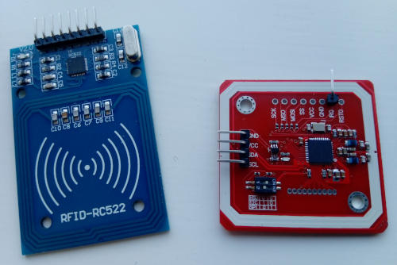
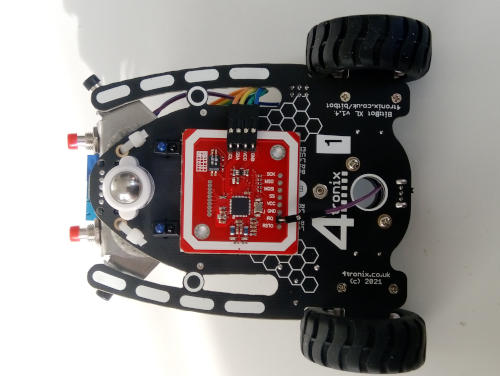
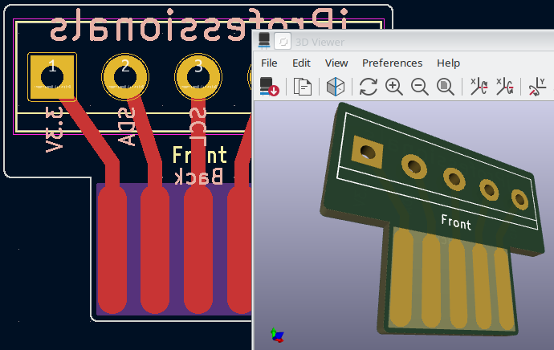
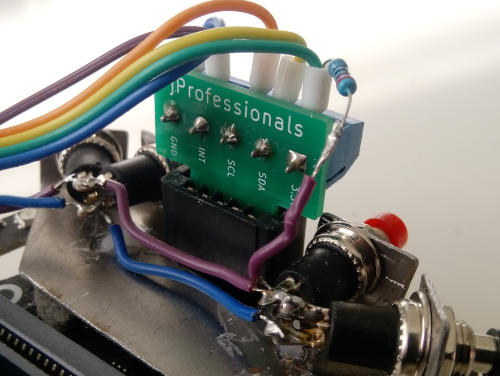

PN532 is a NFC/RFID transceiver based on the 80C51 MCU. It supports SPI, I2C or HighSpeed UART.

We bought two different PN532 boards:  
  
It turns out the blue is SPI only. The red has switches to change between the 3 modes. You need to solder on pins yourself. For I2C, you need pins for GND, VCC, SDA, SCL, and optionally the IRQ pin. In the image you can see how we soldered them, and the switch setting for selecting I2C.

We ended up mounting the board under the Bit:Bot XL using double sided foam tape and Dupont wires:  

To connect the board to the Bit:Bot XL, we made a small PCB that fit in the robot front connector and soldered on a 5-pin Bornier connector. The front connector exposes the I2C bus, and was perfect for the task. The PCB was designed in KiCAD, and was extremely simple:  
  
Feel free to use our [Gerber file](PCB/i2c_connector.zip) if you want to order your own PCBs from [JLCPCB](https://jlcpcb.com/) or similiar companies.

The final assembly looks like this:  
  
(The resistor connected to +3.3V is a 2.2K pull-up resistor used for the front bumper collision detection switches. This has nothing to do with the RFID reader, except for that the front connector seems to be the only place on the robot that exposes +3.3V needed for the Micro:bit P1/P2 GPIOs)
